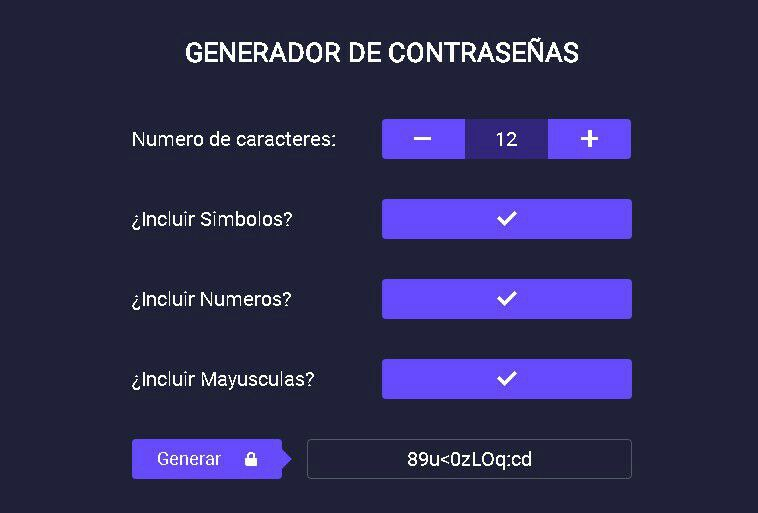

# Generador de contraseñas

   

## Características

- Generación de contraseñas aleatorias.
- Personalización de la longitud de la contraseña.
- Opción para incluir símbolos, números y letras mayúsculas/minúsculas.
- Interfaz de usuario sencilla y amigable.

## Tecnologías Utilizadas

- **HTML**: Estructura básica de la aplicación.
- **CSS**: Estilos y diseño visual.
- **JavaScript**: Lógica para generar contraseñas.

## Instalación

1. Clona este repositorio en tu máquina local:
bash
   git clone https://github.com/nanditavelasquez/Contrasenas.git

2. Navega al directorio del proyecto:  
bash
   cd generador-contraseñas

3. Abre el archivo index.html en tu navegador web.

## Uso

1. Abre la aplicación en tu navegador.
2. Selecciona la longitud deseada para la contraseña.
3. Elige si deseas incluir números, letras mayúsculas y símbolos.
4. Haz clic en el botón "Generar Contraseña" para obtener una nueva contraseña.
5. Copia la contraseña generada y úsala donde la necesites.

## Contribuciones

Las contribuciones son bienvenidas. Si deseas mejorar este proyecto, por favor sigue estos pasos:

1. Haz un fork del repositorio.
2. Crea una nueva rama (git checkout -b feature/nueva-caracteristica).
3. Realiza tus cambios y haz commit (git commit -m 'Añadir nueva característica').
4. Haz push a la rama (git push origin feature/nueva-caracteristica).
5. Abre un Pull Request.
